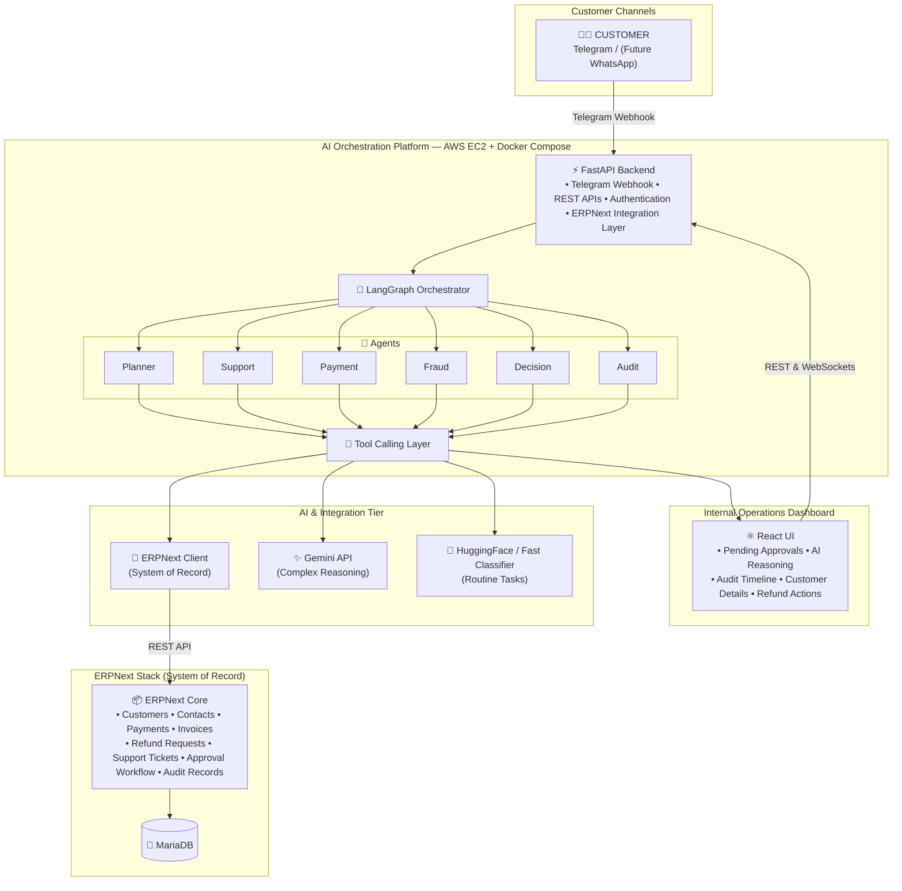

# Enterprise Agentic Financial Operations Assistant (FinOps AI Employee)

[](https://fastapi.tiangolo.com)
[](https://langchain-ai.github.io/langgraph/)
[](https://erpnext.com)
[](https://react.dev)
[](https://telegram.org)
[](https://terraform.io)

An autonomous, auditable, enterprise-grade AI employee for corporate financial operations. Sitting in front of **ERPNext** (the System of Record), the system automates customer payment dispute intake, ledger reconciliation, multi-factor fraud detection, refund recommendations, and human-in-the-loop (HITL) approval workflows.

---

## 🏛️ AI Orchestration Platform — System Architecture



---

## 🚀 Quickstart (1-Click Local Execution)

### 1. Automated Script (Windows)
```cmd
.\scripts\run_local.bat
```

### 2. Manual Commands
```bash
# 1. Activate Python Environment & Run Backend
python -m venv .venv
source .venv/bin/activate # On Windows: .venv\Scripts\activate
pip install -r requirements.txt
uvicorn backend.app.main:app --host 0.0.0.0 --port 8000 --reload

# 2. Run React Operations Hub (In separate terminal)
cd frontend
npm run dev
```

* **React Operations Hub**: `http://localhost:3000`
* **FastAPI Swagger API Docs**: `http://localhost:8000/docs`
* **Health Endpoint**: `http://localhost:8000/health`

---

## 🤖 24-Hour Hackathon Demo Walkthrough

1. **Act I (The Problem)**:
   - Customer is double billed on ERPNext invoice `INV-2026-001` ($150.00).
2. **Act II (Autonomous Resolution via Telegram)**:
   - Open Telegram and message the bot: `"Hi, I was double charged for invoice INV-2026-001 ($150.00)."`
   - The AI employee responds in $<2$ seconds, verifies the duplicate in ERPNext, scores risk at `0.08` (Safe), posts the refund `Payment Entry` to ERPNext, and returns the confirmation receipt.
   - The React Hub live stream updates simultaneously via WebSockets.
3. **Act III (Human-in-the-Loop Financial Governance)**:
   - Message the bot: `"Requesting $850.00 refund on invoice INV-2026-045."`
   - High-value threshold ($>\$200.00$) pauses autonomous execution and pushes an interactive card to the Finance Manager on Telegram: `[✅ Approve $850.00]` `[❌ Reject]`.
   - The manager clicks `Approve` directly in Telegram, immediately triggering ERPNext execution and updating the dashboard.
4. **Act IV (Cryptographic Audit Ledger)**:
   - Open the **Cryptographic Audit** tab on the React Hub to inspect the SHA-256 state-chained audit trail verifying every decision.

---

## 🔒 Financial Safety Invariants

- **Auto-Refund Threshold**: Maximum \$200.00 USD.
- **Fraud Risk Ceiling**: Maximum 0.30 composite risk score.
- **Idempotency Fingerprint**: Zero duplicate ledger entries on retries.
- **Zero Core Modification**: Frappe/ERPNext core is completely untouched.

---

## ☁️ AWS Cloud Deployment (Terraform)

```bash
cd infra/terraform
terraform init
terraform apply -var="gemini_api_key=YOUR_KEY" -var="telegram_bot_token=YOUR_TOKEN"
```
Outputs the public Elastic IP and live URLs for the React Hub (`:3000`) and FastAPI API (`:8000`).
