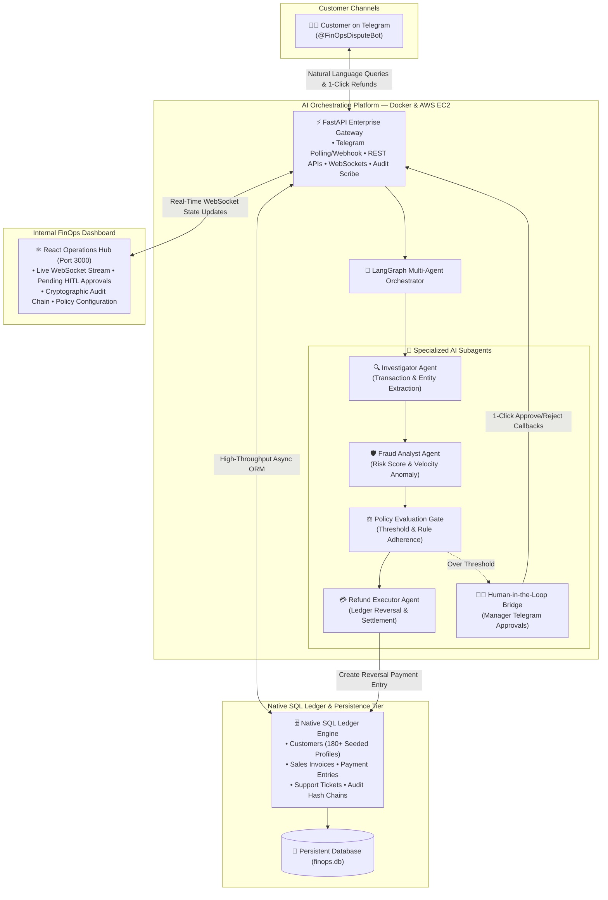

# Enterprise Agentic Financial Operations Assistant (FinOps AI Employee)

[](https://fastapi.tiangolo.com)
[](https://langchain-ai.github.io/langgraph/)
[](https://react.dev)
[](https://telegram.org)
[](https://hub.docker.com/u/suryadocker0)
[](LICENSE)

An autonomous, auditable, enterprise-grade AI Employee for corporate financial operations. Sitting in front of the **ERP / SQL Ledger** (the System of Record), the platform automates customer payment dispute intake, ledger reconciliation, multi-factor fraud detection, autonomous refund execution, and human-in-the-loop (HITL) approval escalation with cryptographic SHA-256 audit chaining.

---

## 🏛️ System Architecture



---

## 🌟 Key Features

1. **🤖 Autonomous Multi-Agent Orchestration (LangGraph)**:
   * **Investigator Agent**: Locates customer profiles and past invoices using exact and fuzzy NLP matching.
   * **Fraud Analyst Agent**: Evaluates chargeback velocity, transaction anomalies, and calculates risk scores ($< 0.30$).
   * **Policy Gate**: Applies corporate rules (e.g. Max Auto-Refund $\le \$200.00$ / ₹15,000).
   * **Refund Executor**: Directly creates double-entry ledger reversals in the SQL database.
   * **HITL Escalation Bridge**: Automatically sends interactive 1-Click approval requests to managers on Telegram for high-risk or high-value cases.

2. **📱 Rich Telegram Customer Support Bot (`@FinOpsDisputeBot`)**:
   * **Past Transactions Lookup by Username**: Users can type `/user <username>` or their name (`Rahul Sharma`, `Sarah Jenkins`) to instantly view their past invoices.
   * **1-Click Automated Refunds**: Interactive Telegram inline buttons to dispute transactions and trigger instant AI investigations.
   * **Natural Language Processing**: Recognizes duplicate payment claims, amounts, invoice numbers, and phone numbers seamlessly.

3. **🗄️ Native Enterprise SQL Ledger Engine**:
   * Complete replacement for external cloud dependencies with a native SQLAlchemy ORM architecture.
   * Auto-seeded with **180+ Enterprise and Retail accounts** with persistent volume storage (`./data/finops.db`).

4. **🔒 Cryptographic SHA-256 Audit Trail**:
   * Every AI reasoning step, policy check, and ledger mutation is stamped with an immutable cryptographic SHA-256 hash chain and exportable SOX/SOC-2 compliance certificates.

5. **⚡ Full-Stack Real-Time Dashboard (React 18 + WebSockets)**:
   * Live streaming of dispute states, risk distribution charts, audit timelines, and manager override controls.

---

## 👥 Demo Showcase Personas (Telegram Cheat-Sheet)

Test the system immediately by messaging `@FinOpsDisputeBot` using any of these 5 pre-seeded customer profiles:

| Customer Name | Customer ID | Registered Mobile | Registered Email | Key Invoices | Demonstration Scenario |
| :--- | :--- | :--- | :--- | :--- | :--- |
| **Rahul Sharma** | `CUST-00045` | `9876543210` | `rahul.sharma@gmail.com` | `INV-2026-001` (₹2,350)<br/>`INV-2026-134` ($134) | **Duplicate Payment Auto-Refund** ⚡<br/>_Type: "I got double charged ₹2350 for INV-2026-001"_ |
| **Sarah Jenkins** | `CUST-00101` | `9876500101` | `sarah.jenkins@techstartup.io` | `INV-2026-101` ($180)<br/>`INV-2026-102` ($95) | **Instant Low-Risk Auto Approval** 🟢<br/>_Type: "/user Sarah Jenkins" then tap Refund_ |
| **Vikramaditya Roy** | `CUST-00102` | `9876500102` | `vikram.roy@royenterprises.in` | `INV-2026-201` (₹14,500)<br/>`INV-2026-202` (₹3,200) | **High-Value HITL Manager Escalation** 🛡️<br/>_Triggers manager approval keyboard in Telegram_ |
| **Elena Rostova** | `CUST-00103` | `9876500103` | `elena.rostova@finpay.eu` | `INV-2026-301` ($65)<br/>`INV-2026-302` ($134) | **Custom Amount Under Threshold** 💳<br/>_Type: "Refund $134 on invoice INV-2026-302"_ |
| **David Miller** | `CUST-00104` | `9876500104` | `david.miller@acmeretail.com` | `INV-2026-401` ($149)<br/>`INV-2026-402` ($750) | **Smart POS Hardware Support Ticket** 🏢<br/>_Creates support issue in SQL database_ |

---

## 🐳 Docker Deployment (Local & Docker Desktop)

The application is pre-configured with Docker Compose under Docker Hub repository **`suryadocker0`**:

```bash
# 1. Build and start all containers in detached mode
docker compose up -d --build

# 2. Verify containers are active and healthy
docker ps
```

### Deployed Services:
* 🖥️ **React Operations Dashboard**: [`http://localhost:3000`](http://localhost:3000)
* ⚡ **FastAPI Backend & Swagger UI**: [`http://localhost:8000/docs`](http://localhost:8000/docs)
* 🩺 **Health Check Endpoint**: [`http://localhost:8000/health`](http://localhost:8000/health)

---

## ☁️ AWS EC2 Cloud Deployment Guide

To deploy this project on an **AWS EC2 Instance** from another machine:

### 1. Launch EC2 Instance
* **AMI**: Ubuntu 24.04 LTS or 22.04 LTS (64-bit x86).
* **Instance Type**: `t3.small` or `t3.medium` (2 vCPU, 2GB–4GB RAM).
* **Security Group Inbound Rules**:
  * Port `22` (SSH)
  * Port `3000` (React Dashboard)
  * Port `8000` (FastAPI Backend & WebSockets)
  * Port `80` (HTTP)

### 2. Connect and Install Dependencies
```bash
# SSH into EC2
ssh -i "your-key.pem" ubuntu@<YOUR-EC2-PUBLIC-IP>

# Install Git & Docker Compose
sudo apt update && sudo apt upgrade -y
sudo apt install -y git docker.io docker-compose-v2
sudo usermod -aG docker $USER
newgrp docker
```

### 3. Clone Repository & Configure Environment
```bash
git clone https://github.com/Ruthvik4257/Agentic_Financial_Operations_Assitant.git
cd Agentic_Financial_Operations_Assitant

# Configure environment variables
cat << 'EOF' > .env
ENVIRONMENT=production
PORT=8000
DATABASE_URL=sqlite+aiosqlite:///./data/finops.db

# LLM Reasoning Engine
GEMINI_API_KEY=your_gemini_api_key_here
GEMINI_MODEL=gemini-2.0-flash

# Telegram Bot Integration
TELEGRAM_BOT_TOKEN=your_telegram_bot_token_here
TELEGRAM_MODE=polling

# Operational Thresholds
MAX_AUTO_REFUND_LIMIT=200.00
MAX_FRAUD_RISK_THRESHOLD=0.30
EOF
```

### 4. Launch with Docker Compose
```bash
docker compose up -d --build
```
Access the application at `http://<YOUR-EC2-PUBLIC-IP>:3000`!

---

## 🧪 Testing & Verification

The repository includes a comprehensive unit and integration test suite covering agent state transitions, duplicate detection, cryptographic audit chains, and gateway webhooks.

```bash
# Run the complete test suite
pytest backend/tests/ -v
```

**Results**: `14 passed in ~16s (100% pass rate)`.

---

## 📂 Repository Structure

```text
├── agents/                       # Multi-Agent State Machine & Logic
│   ├── graph.py                  # LangGraph StateGraph Definition
│   ├── state.py                  # DisputeRecord & Agent State Schemas
│   └── models/                   # Gemini & Fast Classifier Factory
├── backend/
│   ├── app/
│   │   ├── api/v1/               # REST Endpoints (Disputes, Support, Gateways, WS)
│   │   ├── core/                 # Config & Database Auto-Seed Engine
│   │   ├── models/               # SQLAlchemy Models (Customer, Invoice, Payment, Support)
│   │   └── services/             # SQLLedgerService, AuditService, TelegramService
│   └── tests/                    # Pytest Suite (Agents, Ledger, Gateways, Audit)
├── docker/                       # Backend & Frontend Dockerfiles
├── frontend/                     # React 18 Operations Dashboard
├── data/                         # Persistent SQLite Ledger Storage (finops.db)
├── docker-compose.yml            # Container Orchestration Specification
└── requirements.txt              # Pinned Python Dependencies
```

---

## 📄 License

Distributed under the **MIT License**. See `LICENSE` for more information.
